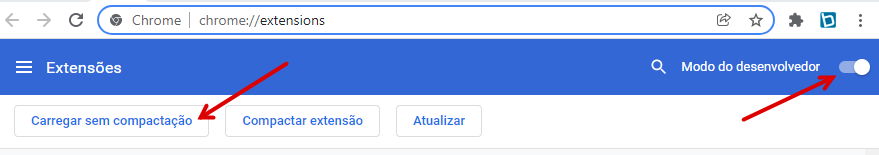

# addon-clipping

Encurta a url da página aberta e faz um resumo da notícia montando um clipping de notícias.

## Guia para instalar a extensão

1. Baixe o arquivo `addon-clipping.zip` [clicando aqui neste link](https://github.com/izidorio/addon-clipping/releases/download/v1.0.0/addon-clipping.zip)

2. Descompacte o arquivo baixado `addon-clipping.zip`.

3. Abra o navegador Chrome, na barra de endereço, cole o endereço: `chrome://extensions/` para abrir o gerenciador de extensões do Chrome.

4. Habilite o Modo do desenvolvedor.

5. Carregue a extensão clicando no botão: `Carregar sem compactação` e depois selecione a pasta `addon-clipping` que você descompactou.

6. Crie uma conta no [bitly](https://bitly.com/) e gere um Token para utilizar a api para encurtar as URLs

> > Settings / Api / Access Token `Generate token`

7. Cole o Token em **preferências**. Você também poderá alterar os outros valores do cabeçalho e emojis se desejar
