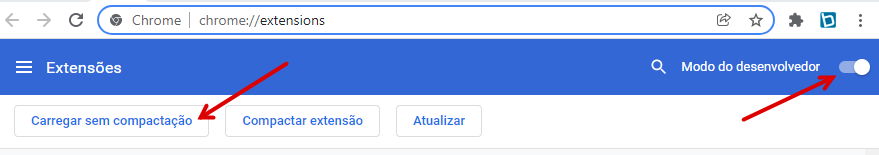

# addon-clipping

Faz a captura da página aberta criando um resumo e encurtando a url ( utilizando a API do encurtador.dev®) para montar um clipping de notícias.

<center>

</center>

## Guia para instalar a extensão

1. Baixe a última versão do `addon-clipping ` [clicando aqui neste link.](https://github.com/izidorio/addon-clipping/releases/download/v1.1.0/addon-clipping.zip)

2. Descompacte o arquivo `addon-clipping.zip` baixado.

3. Abra o navegador Chrome, na barra de endereço, cole o endereço: `chrome://extensions/` para abrir o gerenciador de extensões do Chrome.

4. Habilite o Modo do desenvolvedor.

5. Carregue a extensão clicando no botão: `Carregar sem compactação` e depois selecione a pasta `addon-clipping` que você descompactou.
<center>

</center>

6. A nova versão 1.1.0 utiliza a API do [encurtador.dev](https://www.encurtador.dev/termos.html) por isso é importante a aceitação do termos e condições de uso.

## Guia para desenvolvedores

clone o repositório

```bash
git clone git@github.com:izidorio/addon-clipping.git
```

mova-se para o diretório do projeto e instale as dependências

```bash
cd addon-clipping
npm install
```

faça o build do projeto

```
npm run build
```

Abra o gerenciador de extensões do Chrome.

Habilite o Modo do desenvolvedor.

Carregue a extensão clicando no botão: Carregar sem compactação e depois selecione a pasta `/dist`
